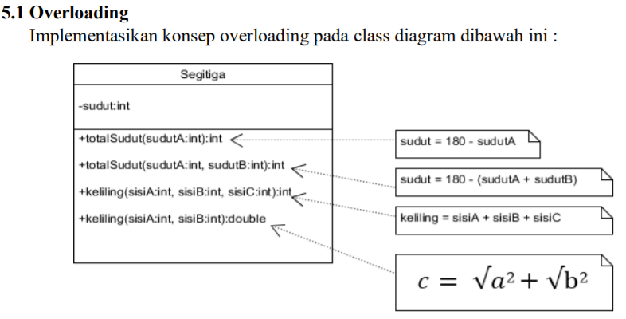

### Praktikum PBO 7
This is the sevent repository from PBO Practice in State Polytechnic of Malang. It is coded with Java Programming language. implements overloading and overriding program from given class diagram in Jobsheet.

- 📝 Pdf filename :[2C_24_Yudas Malabi.pdf](https://github.com/Yudas1337/Praktikum_PBO_7/blob/master/2C_24_Yudas%20Malabi.pdf)

### Main Topic : Overloading and Overriding
### Class Diagram : 

### Class Structure For Overloading :
<ul>
  <li>Segitiga : Representing Segitiga class with some overloading methods</li>
  <ul>
    <li>totalSudut(sudutA: int): int</li>
    <li>totalSudut(sudutA: int, sudutB: int): int</li>
    <li>keliling(sisiA: int, sisiB: int, sisiC: int): int</li>
    <li>keliling(sisiA: int, sisiB: int): double</li>
  </ul>
  <li>Main : Run the java program from each declared class</li>
</ul>

### Class Structure For Overriding :
<ul>
  <li>Manusia : Representing Manusia class for parent class</li>
   <ul>
    <li>bernafas(): void</li>
    <li>makan(): void</li>
  </ul>
  <li>Dosen : Representing Dosen class that have inherit from Manusia class</li>
  <ul>
    <li>lembur(): void</li>
    <li>makan(): void</li>
  </ul>
  <li>Mahasiswa : Representing Mahasiswa class that have inherit from Manusia class</li>
   <ul>
    <li>makan(): void</li>
    <li>tidur(): void</li>
  </ul>
  <li>Main : Run the java program from each declared class</li>
</ul>

### Technologies :
<ul>
<li>Java Object Oriented Programming</li>
<li>IDE : Visual Studio Code with java plugins for compiler</li>
</ul>

### Credits : Yudas Malabi 😄✌️
